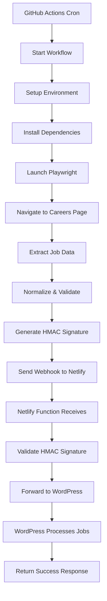
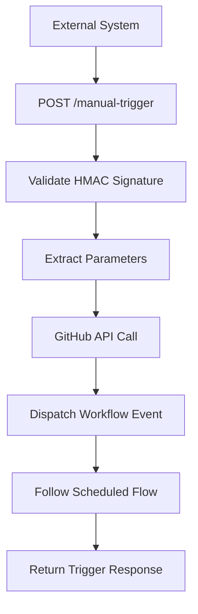
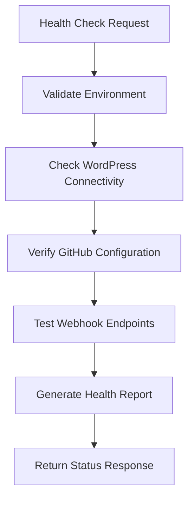

# DriveHR Netlify Sync - Architecture Documentation

**Version 2.0 - GitHub Actions + Netlify Functions**

## 📋 Table of Contents

- [System Overview](#system-overview)
- [Architecture Components](#architecture-components)
- [Data Flow](#data-flow)
- [Security Model](#security-model)
- [Technology Stack](#technology-stack)
- [Deployment Strategy](#deployment-strategy)
- [Error Handling](#error-handling)
- [Monitoring & Observability](#monitoring--observability)
- [Performance Considerations](#performance-considerations)
- [Migration from Legacy](#migration-from-legacy)

## 🎯 System Overview

DriveHR Netlify Sync is a modernized job synchronization service that employs a
distributed architecture with GitHub Actions for job scraping and Netlify
Functions for webhook processing. This design separates concerns, improves
reliability, and enables horizontal scaling.

### Core Principles

- **Separation of Concerns**: Scraping and processing are decoupled
- **Event-Driven Architecture**: Webhook-based communication between components
- **Security by Design**: HMAC signature validation and comprehensive security
  headers
- **Observability First**: Request tracing and structured logging throughout
- **Test-Driven Development**: 333+ tests ensuring reliability

## 🏗️ Architecture Components

### 1. GitHub Actions Scraper

**Purpose**: Automated job data extraction from DriveHR careers pages

**Key Files**:

- `.github/workflows/scrape-jobs.yml` - Workflow definition
- `src/scripts/scrape-and-sync.ts` - Main scraping script
- `src/services/playwright-scraper.ts` - Browser automation service
- `playwright.config.ts` - Playwright configuration

**Responsibilities**:

- Schedule-based job scraping (configurable intervals)
- Browser automation with Playwright for SPA handling
- Data normalization and validation
- Secure webhook payload delivery to Netlify
- Error reporting and retry logic

**Execution Environment**:

- **Runtime**: Node.js 18+ on GitHub-hosted runners
- **Browser**: Chromium (headless mode)
- **Trigger**: Cron schedule or manual workflow dispatch
- **Secrets**: Repository secrets for sensitive configuration

### 2. Netlify Functions Layer

**Purpose**: Lightweight webhook processing and WordPress integration

**Function Endpoints**:

#### `sync-jobs.mts` - Primary Webhook Receiver

- **Method**: POST
- **Path**: `/.netlify/functions/sync-jobs`
- **Purpose**: Receives job data from GitHub Actions and forwards to WordPress
- **Features**: HMAC validation, CORS handling, comprehensive error responses

#### `health-check.mts` - System Health Monitoring

- **Method**: GET
- **Path**: `/.netlify/functions/health-check`
- **Purpose**: System health validation and configuration verification
- **Features**: Dependency checks, environment validation, monitoring metrics

#### `manual-trigger.mts` - On-Demand Workflow Triggers

- **Method**: POST
- **Path**: `/.netlify/functions/manual-trigger`
- **Purpose**: Manually trigger GitHub Actions scraping workflow
- **Features**: GitHub API integration, force sync options, authentication

### 3. Service Layer

**Core Services**:

#### WordPress Client (`wordpress-client.ts`)

- WordPress REST API integration
- HMAC-authenticated webhook delivery
- Job data synchronization
- Health check capabilities
- Comprehensive error handling

#### HTML Parser (`html-parser.ts`)

- Job data extraction from HTML content
- Configurable CSS selectors
- Data normalization and validation
- URL resolution and sanitization

#### HTTP Client (`http-client.ts`)

- Centralized HTTP request handling
- Retry logic and timeout management
- Request/response logging
- Error boundary implementation

#### Logger (`logger.ts`)

- Structured logging with multiple levels
- Request ID correlation
- Multiple output formats (JSON/plain text)
- Context-aware error reporting

### 4. Type System

**Type Definitions**:

- **Job Types** (`job.ts`): Comprehensive job data structures
- **API Types** (`api.ts`): HTTP request/response interfaces
- **Common Types** (`common.ts`): Shared utilities and base types
- **Config Types** (`config.ts`): Environment and configuration schemas

## 🔄 Data Flow

### 1. Scheduled Execution Flow

### 2. Manual Trigger Flow

### 3. Health Check Flow

## 🔐 Security Model

### Authentication & Authorization

1. **HMAC Signature Validation**
   - SHA-256 HMAC signatures on all webhook payloads
   - Shared secret configuration via environment variables
   - Timing-safe signature comparison to prevent timing attacks

2. **GitHub Actions Security**
   - Repository secrets for sensitive configuration
   - Minimal permission scopes for API access
   - Secure workflow triggers with authentication

3. **WordPress Integration Security**
   - Application passwords for WordPress authentication
   - HTTPS-only communication
   - Request timeout and retry limits

### Network Security

1. **CORS Configuration**
   - Restricted origins (GitHub.com domains)
   - Specific allowed methods and headers
   - Preflight request handling

2. **Security Headers**
   - Content Security Policy (CSP)
   - X-Frame-Options: DENY
   - X-Content-Type-Options: nosniff
   - Referrer-Policy restrictions
   - Permissions-Policy limitations

3. **Request Validation**
   - Input sanitization and validation
   - JSON payload size limits
   - Rate limiting considerations

## 🛠️ Technology Stack

### Runtime & Languages

- **Node.js 18+**: Runtime environment with ES modules
- **TypeScript 5.0+**: Strict typing with modern ECMAScript features
- **ES Modules**: Modern module system (.mts extensions)

### Testing & Quality

- **Vitest**: Fast unit and integration testing
- **ESLint**: Code quality and style enforcement
- **Prettier**: Consistent code formatting
- **TypeScript Compiler**: Strict type checking

### Browser Automation

- **Playwright**: Modern browser automation framework
- **Chromium**: Headless browser for scraping

### Deployment & Infrastructure

- **Netlify Functions**: Serverless function hosting
- **GitHub Actions**: CI/CD and scheduled automation
- **pnpm**: Fast, efficient package management

### Monitoring & Observability

- **Structured Logging**: JSON and plain text output formats
- **Request Tracing**: Unique request ID generation
- **Health Checks**: Endpoint-based system monitoring

## 🚀 Deployment Strategy

### GitHub Actions Deployment

1. **Workflow Configuration**
   - Scheduled execution (configurable cron)
   - Manual dispatch triggers
   - Secure secret management
   - Multi-step job execution

2. **Environment Setup**
   - Node.js 18+ runtime
   - Playwright browser installation
   - Dependency caching for performance

3. **Execution Strategy**
   - Headless browser automation
   - Error capture and reporting
   - Webhook delivery with retries

### Netlify Functions Deployment

1. **Function Configuration**
   - Modern Netlify Functions format
   - ES module support
   - TypeScript compilation
   - Automatic dependency bundling

2. **Environment Management**
   - Netlify environment variables
   - Secret configuration
   - Multi-environment support (dev/staging/prod)

3. **Deployment Pipeline**
   - Git-based deployments
   - Automatic function discovery
   - Zero-downtime deployments

## ⚠️ Error Handling

### Error Categories

1. **Scraping Errors**
   - Page load failures
   - Element not found errors
   - Data extraction failures
   - Browser automation timeouts

2. **Network Errors**
   - HTTP request failures
   - Timeout errors
   - DNS resolution issues
   - Rate limiting responses

3. **Validation Errors**
   - Invalid HMAC signatures
   - Malformed JSON payloads
   - Missing required fields
   - Type validation failures

4. **Integration Errors**
   - WordPress API failures
   - GitHub API errors
   - Authentication failures
   - Configuration errors

### Error Handling Strategies

1. **Retry Logic**
   - Exponential backoff for transient failures
   - Maximum retry limits
   - Circuit breaker patterns for persistent failures

2. **Graceful Degradation**
   - Partial success handling
   - Fallback mechanisms
   - Error boundary implementation

3. **Error Reporting**
   - Structured error logging
   - Context preservation
   - Request correlation tracking
   - External monitoring integration

## 📊 Monitoring & Observability

### Logging Strategy

1. **Request Correlation**
   - Unique request ID generation
   - Distributed tracing across services
   - Context-aware logging

2. **Log Levels**
   - ERROR: Critical failures requiring attention
   - WARN: Important but non-critical issues
   - INFO: General operational information
   - DEBUG: Detailed debugging information
   - TRACE: Fine-grained execution details

3. **Structured Logging**
   - JSON format for machine processing
   - Consistent field naming
   - Contextual metadata inclusion

### Health Monitoring

1. **System Health Checks**
   - Environment configuration validation
   - External dependency connectivity
   - Resource availability monitoring

2. **Performance Metrics**
   - Function execution times
   - Job processing rates
   - Error frequencies
   - Success/failure ratios

3. **Alerting & Notifications**
   - Threshold-based alerting
   - Error rate monitoring
   - Dependency failure detection

## ⚡ Performance Considerations

### Scraping Performance

1. **Browser Optimization**
   - Headless mode for reduced overhead
   - Resource filtering (images, fonts)
   - Network request caching
   - Parallel processing where possible

2. **Execution Efficiency**
   - Minimal page load requirements
   - Optimized selector strategies
   - Batch processing of jobs
   - Memory management

### Function Performance

1. **Cold Start Optimization**
   - Minimal dependency loading
   - Efficient module imports
   - Connection pooling where applicable

2. **Processing Efficiency**
   - Streaming JSON processing
   - Minimal memory footprint
   - Efficient data transformations

3. **Caching Strategies**
   - Configuration caching
   - HTTP response caching
   - Browser state persistence

## 🔄 Migration from Legacy

### Legacy Architecture (v1.0)

The previous architecture used a monolithic Netlify Function approach:

- Direct job fetching from multiple sources (API, JSON, embedded)
- Synchronous processing model
- Limited error handling and monitoring
- Basic authentication mechanisms

### Migration Benefits (v2.0)

1. **Improved Reliability**
   - Distributed architecture reduces single points of failure
   - Comprehensive error handling and retry logic
   - Better resource isolation and management

2. **Enhanced Security**
   - HMAC signature validation for all communications
   - Comprehensive security headers
   - Principle of least privilege implementation

3. **Better Observability**
   - Request tracing and correlation
   - Structured logging with multiple levels
   - Health monitoring and alerting capabilities

4. **Increased Maintainability**
   - Modular architecture with clear separation of concerns
   - Comprehensive test coverage (333+ tests)
   - Type-safe interfaces throughout

### Backward Compatibility

The migration maintains compatibility for:

- Environment variable configuration
- WordPress integration endpoints
- Manual trigger functionality
- Health check interfaces

### Breaking Changes

- Removed direct API/JSON/embedded fetch strategies
- Changed function signature for sync-jobs (now webhook-only)
- Updated CORS configuration for GitHub Actions origins
- Modified logging format and structure

---

**Document Version**: 2.0  
**Last Updated**: January 2025  
**Next Review**: June 2025
