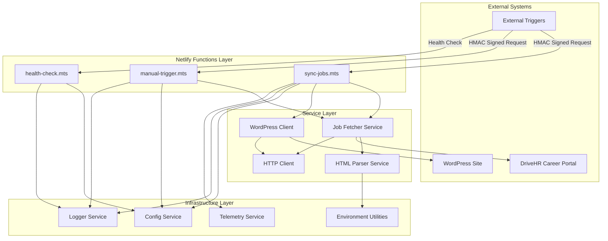
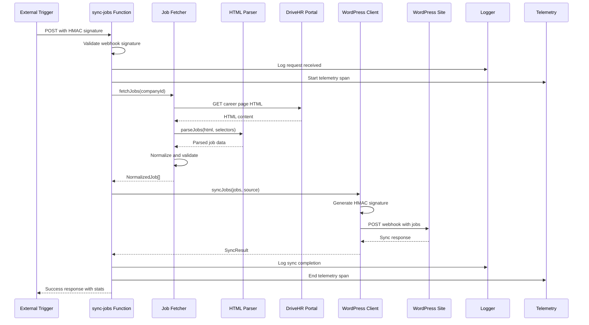
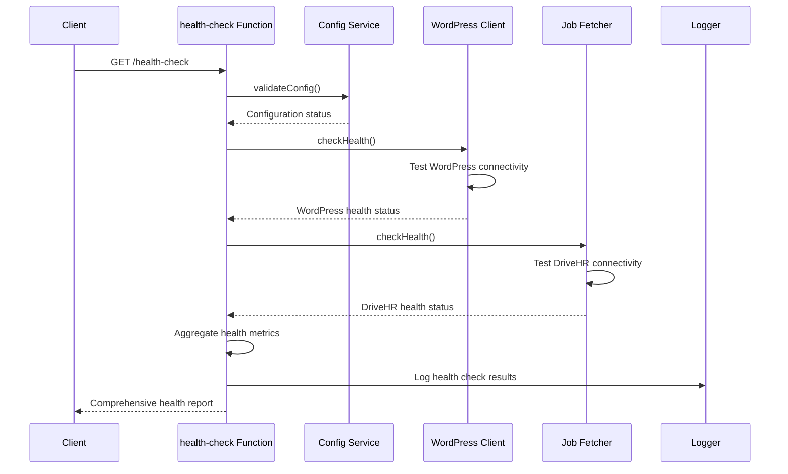

# Architecture Documentation

> **DriveHR Netlify Sync - System Architecture & Design Principles**

## 📋 Table of Contents

- [System Overview](#-system-overview)
- [Architecture Principles](#-architecture-principles)
- [System Components](#-system-components)
- [Data Flow](#-data-flow)
- [Service Layer](#-service-layer)
- [Security Architecture](#-security-architecture)
- [Error Handling Strategy](#-error-handling-strategy)
- [Performance & Scalability](#-performance--scalability)
- [Monitoring & Observability](#-monitoring--observability)
- [Type System](#-type-system)
- [Testing Architecture](#-testing-architecture)

## 🎯 System Overview

DriveHR Netlify Sync is a **serverless job synchronization service** built on
Netlify Functions that provides secure, reliable job data synchronization
between DriveHR's career portal and WordPress sites through webhook integration.

### Core Architecture



### Key Characteristics

- **Serverless Architecture**: Zero-infrastructure Netlify Functions
- **Event-Driven**: Webhook-triggered job synchronization
- **Secure by Design**: HMAC signature validation and enterprise security
  headers
- **Type-Safe**: Full TypeScript with strict configuration
- **Observable**: Comprehensive logging, health checks, and telemetry
- **Testable**: 80%+ test coverage with comprehensive test suite

## 🏛️ Architecture Principles

### 1. **Separation of Concerns**

Each component has a single, well-defined responsibility:

- Functions handle HTTP requests and responses
- Services encapsulate business logic
- Utilities provide cross-cutting concerns

### 2. **Dependency Injection**

Services receive dependencies through constructors, enabling:

- Easy testing with mocks
- Flexible configuration
- Clear dependency relationships

### 3. **Fail-Safe Design**

- Graceful degradation under failure conditions
- Comprehensive error handling and logging
- Health checks for dependency validation

### 4. **Security First**

- All inputs validated and sanitized
- HMAC signature validation for all webhooks
- Comprehensive security headers
- Principle of least privilege

### 5. **Observability**

- Structured logging with correlation IDs
- Performance metrics and telemetry
- Health monitoring and alerting
- Distributed tracing support

## 🏗️ System Components

### Netlify Functions Layer

#### `health-check.mts`

**Purpose**: System health monitoring and configuration validation

```typescript
export const handler = async (
  event: HandlerEvent
): Promise<HandlerResponse> => {
  // Validates all system dependencies
  // Returns comprehensive health status
  // Includes performance metrics
};
```

**Responsibilities**:

- Environment configuration validation
- External dependency connectivity checks
- System performance metrics
- Service availability status

#### `sync-jobs.mts`

**Purpose**: Main job synchronization webhook processor

```typescript
export const handler = async (
  event: HandlerEvent
): Promise<HandlerResponse> => {
  // Validates HMAC signatures
  // Fetches jobs from DriveHR
  // Synchronizes with WordPress
  // Returns sync statistics
};
```

**Responsibilities**:

- Webhook signature validation
- Job data retrieval and processing
- WordPress integration
- Sync result reporting

#### `manual-trigger.mts`

**Purpose**: Administrative manual synchronization trigger

```typescript
export const handler = async (
  event: HandlerEvent
): Promise<HandlerResponse> => {
  // Validates admin privileges
  // Triggers manual sync operations
  // Provides detailed execution feedback
};
```

**Responsibilities**:

- Administrative access control
- Manual sync triggering
- Operation auditing and logging
- Status reporting

### Service Layer Architecture

#### Job Fetcher Service (`job-fetcher.ts`)

**Purpose**: DriveHR job data retrieval and normalization

```typescript
class JobFetcher implements IJobFetcher {
  constructor(
    private readonly httpClient: IHttpClient,
    private readonly htmlParser: IHtmlParser,
    private readonly logger: ILogger
  ) {}

  async fetchJobs(companyId: string): Promise<NormalizedJob[]> {
    // Fetch HTML content from DriveHR
    // Parse job data using HTML parser
    // Normalize and validate job structures
    // Return type-safe job objects
  }
}
```

**Key Features**:

- HTML content retrieval from DriveHR career pages
- CSS selector-based job data extraction
- Job data normalization and validation
- Error handling and retry logic

#### HTML Parser Service (`html-parser.ts`)

**Purpose**: Job data extraction from HTML content

```typescript
class HtmlParser implements IHtmlParser {
  parseJobs(html: string, selectors: JobSelectors): RawJob[] {
    // Load HTML into DOM parser
    // Extract job data using CSS selectors
    // Clean and normalize extracted data
    // Return structured job objects
  }
}
```

**Key Features**:

- CSS selector-based data extraction
- HTML sanitization and cleaning
- URL resolution and validation
- Data structure normalization

#### WordPress Client Service (`wordpress-client.ts`)

**Purpose**: WordPress webhook integration and job synchronization

```typescript
class WordPressClient implements IWordPressClient {
  constructor(
    private readonly httpClient: IHttpClient,
    private readonly config: IConfig,
    private readonly logger: ILogger
  ) {}

  async syncJobs(jobs: NormalizedJob[], source: string): Promise<SyncResult> {
    // Generate HMAC signature for webhook
    // Send job data to WordPress endpoint
    // Handle response and error conditions
    // Return sync statistics
  }
}
```

**Key Features**:

- HMAC-authenticated webhook delivery
- Comprehensive error handling
- Retry logic with exponential backoff
- Sync result tracking and reporting

## 🔄 Data Flow

### Primary Sync Flow



### Health Check Flow



## 🛡️ Security Architecture

### Authentication & Authorization

```typescript
// HMAC Signature Validation
const validateWebhookSignature = (
  payload: string,
  signature: string,
  secret: string
): boolean => {
  const expectedSignature = crypto
    .createHmac('sha256', secret)
    .update(payload, 'utf8')
    .digest('hex');

  const providedSignature = signature.replace('sha256=', '');

  return crypto.timingSafeEqual(
    Buffer.from(expectedSignature, 'hex'),
    Buffer.from(providedSignature, 'hex')
  );
};
```

### Security Headers Implementation

```typescript
const securityHeaders = {
  'Content-Security-Policy': "default-src 'self'",
  'X-Frame-Options': 'DENY',
  'X-Content-Type-Options': 'nosniff',
  'Referrer-Policy': 'strict-origin-when-cross-origin',
  'Permissions-Policy': 'geolocation=(), microphone=(), camera=()',
  'X-XSS-Protection': '1; mode=block',
};
```

### Input Validation Strategy

- **Schema Validation**: All inputs validated against TypeScript interfaces
- **Sanitization**: HTML content sanitized before processing
- **Type Guards**: Runtime type checking for external data
- **Bounds Checking**: Array and string length validation

## ⚠️ Error Handling Strategy

### Error Classification

```typescript
enum ErrorCategory {
  VALIDATION = 'validation',
  AUTHENTICATION = 'authentication',
  NETWORK = 'network',
  EXTERNAL_SERVICE = 'external_service',
  CONFIGURATION = 'configuration',
  SYSTEM = 'system',
}

class ApplicationError extends Error {
  constructor(
    message: string,
    public readonly category: ErrorCategory,
    public readonly statusCode: number,
    public readonly details?: Record<string, unknown>
  ) {
    super(message);
  }
}
```

### Error Handling Patterns

1. **Graceful Degradation**: Functions continue operating with reduced
   functionality
2. **Circuit Breaker**: Prevent cascading failures with external services
3. **Retry Logic**: Exponential backoff for transient failures
4. **Error Boundaries**: Isolated error handling for each service layer

### Logging Strategy

```typescript
interface LogContext {
  requestId: string;
  functionName: string;
  timestamp: string;
  level: LogLevel;
  message: string;
  metadata?: Record<string, unknown>;
  error?: Error;
}
```

## ⚡ Performance & Scalability

### Function Optimization

```typescript
// Module-level caching to reduce cold start overhead
let configInstance: AppConfig | null = null;
let httpClientInstance: IHttpClient | null = null;

export const handler = async (event: HandlerEvent) => {
  // Reuse cached instances across invocations
  configInstance ??= await loadConfig();
  httpClientInstance ??= createHttpClient(configInstance);

  // Function logic
};
```

### Memory Management

- **Object Pooling**: Reuse expensive objects across invocations
- **Streaming**: Process large datasets without loading into memory
- **Garbage Collection**: Explicit cleanup of large objects
- **Memory Profiling**: Monitor and optimize memory usage patterns

### Caching Strategy

```typescript
interface CacheEntry<T> {
  data: T;
  timestamp: number;
  ttl: number;
}

class MemoryCache<T> {
  private cache = new Map<string, CacheEntry<T>>();

  get(key: string): T | null {
    const entry = this.cache.get(key);
    if (!entry || Date.now() - entry.timestamp > entry.ttl) {
      this.cache.delete(key);
      return null;
    }
    return entry.data;
  }
}
```

## 📊 Monitoring & Observability

### Telemetry Integration

```typescript
// OpenTelemetry Integration
import { trace, SpanKind } from '@opentelemetry/api';

const tracer = trace.getTracer('drivehr-netlify-sync');

export const withSpan = async <T>(
  name: string,
  fn: (span: Span) => Promise<T>,
  attributes?: Record<string, string>,
  kind: SpanKind = SpanKind.INTERNAL
): Promise<T> => {
  return tracer.startActiveSpan(name, { kind, attributes }, async span => {
    try {
      const result = await fn(span);
      span.setStatus({ code: SpanStatusCode.OK });
      return result;
    } catch (error) {
      span.setStatus({ code: SpanStatusCode.ERROR, message: error.message });
      throw error;
    } finally {
      span.end();
    }
  });
};
```

### Health Check Implementation

```typescript
interface HealthCheck {
  name: string;
  status: 'pass' | 'fail' | 'warn';
  duration: number;
  details?: Record<string, unknown>;
  error?: string;
}

const performHealthChecks = async (): Promise<HealthCheck[]> => {
  const checks = [
    checkConfiguration,
    checkWordPressConnectivity,
    checkDriveHRConnectivity,
    checkMemoryUsage,
  ];

  return Promise.all(
    checks.map(check =>
      check().catch(error => ({
        name: check.name,
        status: 'fail' as const,
        duration: 0,
        error: error.message,
      }))
    )
  );
};
```

## 📝 Type System

### Core Type Definitions

```typescript
// Job Data Types
interface NormalizedJob {
  id: string;
  title: string;
  description: string;
  location: Location;
  employmentType: EmploymentType;
  department?: string;
  salaryRange?: SalaryRange;
  postedDate: Date;
  externalUrl: string;
  companyId: string;
}

// Service Interfaces
interface IJobFetcher {
  fetchJobs(companyId: string): Promise<NormalizedJob[]>;
  checkHealth(): Promise<HealthStatus>;
}

interface IWordPressClient {
  syncJobs(jobs: NormalizedJob[], source: string): Promise<SyncResult>;
  checkHealth(): Promise<HealthStatus>;
}

// Configuration Types
interface AppConfig {
  environment: Environment;
  logging: LoggingConfig;
  driveHr: DriveHrConfig;
  wordPress: WordPressConfig;
  webhook: WebhookConfig;
  security: SecurityConfig;
  performance: PerformanceConfig;
}
```

### Type Safety Patterns

```typescript
// Discriminated Unions for Result Types
type Result<T, E = Error> =
  | { success: true; data: T }
  | { success: false; error: E };

// Type Guards for Runtime Validation
const isNormalizedJob = (obj: unknown): obj is NormalizedJob => {
  return (
    typeof obj === 'object' &&
    obj !== null &&
    typeof (obj as NormalizedJob).id === 'string' &&
    typeof (obj as NormalizedJob).title === 'string' &&
    // ... additional validations
  );
};
```

## 🧪 Testing Architecture

### Test Organization

```
test/
├── fixtures/           # Shared test data
│   ├── job-data.ts    # Mock job objects
│   ├── html-content.ts # Sample HTML content
│   └── responses.ts    # Mock HTTP responses
├── utils/             # Test utilities
│   ├── test-factories.ts  # Data factories
│   └── mock-helpers.ts    # Mock creation helpers
├── lib/               # Library tests
├── services/          # Service layer tests
└── functions/         # Function endpoint tests
```

### Test Patterns

```typescript
// Base Test Utilities
export class BaseTestUtils {
  static createMockLogger(): ILogger {
    return {
      debug: vi.fn(),
      info: vi.fn(),
      warn: vi.fn(),
      error: vi.fn(),
    };
  }

  static createMockConfig(overrides?: Partial<AppConfig>): AppConfig {
    return {
      environment: 'test',
      logging: { level: 'error' },
      // ... default test configuration
      ...overrides,
    };
  }
}

// Service-Specific Test Utilities
class JobFetcherTestUtils extends BaseTestUtils {
  static createMockHtmlParser(): IHtmlParser {
    return {
      parseJobs: vi.fn().mockReturnValue([]),
    };
  }

  static createMockHttpClient(): IHttpClient {
    return {
      get: vi.fn(),
      post: vi.fn(),
    };
  }
}
```

### Coverage Standards

- **Line Coverage**: 80%+ (currently 80.46%)
- **Function Coverage**: 90%+ (currently 92.6%)
- **Branch Coverage**: 75%+
- **Critical Path Coverage**: 100%

## 📈 Scalability Considerations

### Horizontal Scaling

- **Stateless Design**: Functions maintain no state between invocations
- **Auto-scaling**: Netlify automatically scales functions based on demand
- **Load Distribution**: Traffic distributed across multiple function instances

### Performance Optimization

- **Cold Start Minimization**: Module-level caching and lazy loading
- **Memory Efficiency**: Streaming processing and garbage collection
- **Network Optimization**: Connection pooling and request batching

### Resource Management

- **Function Limits**: 10-second timeout, 1GB memory limit
- **Rate Limiting**: Prevent abuse and ensure fair resource usage
- **Circuit Breakers**: Prevent cascading failures to external services

---

**Architecture Version**: 2.0  
**Last Updated**: January 2025  
**Next Review**: June 2025
