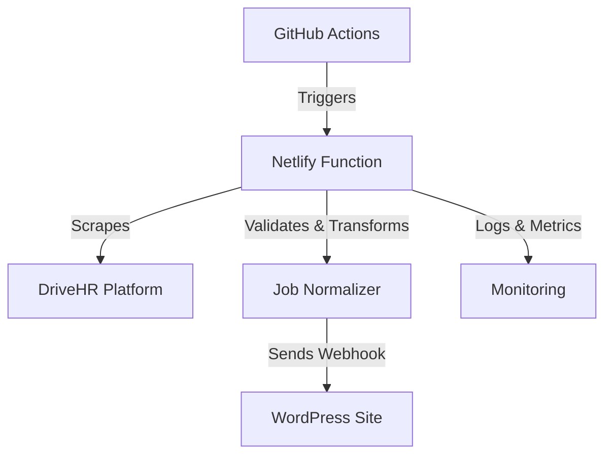

# DriveHR Netlify Sync

[](https://github.com/zachatkinson/drivehr-netlify-sync/actions/workflows/ci.yml)
[](https://codecov.io/gh/zachatkinson/drivehr-netlify-sync)
[](./SECURITY.md)
[](https://GitHub.com/zachatkinson/drivehr-netlify-sync/releases/)
[](https://github.com/semantic-release/semantic-release)
[](https://www.typescriptlang.org/)
[](https://nodejs.org/)
[](https://opensource.org/licenses/MIT)

Enterprise-grade TypeScript serverless function for automated DriveHR job
scraping and WordPress synchronization. Built with modern DevOps practices,
comprehensive testing, and enterprise security standards.

## 🚀 Quick Start

```bash
# Install dependencies
pnpm install

# Run development server
pnpm run dev

# Run tests
pnpm test

# Build for production
pnpm run build

# Deploy to Netlify
netlify deploy --prod
```

## 📋 Table of Contents

- [Overview](#overview)
- [Features](#features)
- [Architecture](#architecture)
- [Installation](#installation)
- [Configuration](#configuration)
- [Usage](#usage)
- [API Reference](#api-reference)
- [Development](#development)
- [Testing](#testing)
- [Deployment](#deployment)
- [Monitoring](#monitoring)
- [Security](#security)
- [Contributing](#contributing)
- [License](#license)

## Overview

DriveHR Netlify Sync is a modern serverless application that automatically
scrapes job postings from DriveHR and synchronizes them with WordPress sites via
secure webhooks. Built for enterprise environments with reliability, security,
and observability as core principles.

### Key Benefits

- **Zero-downtime deployments** with Netlify Functions
- **Enterprise security** with HMAC signature validation
- **Intelligent scraping** with Playwright-based automation
- **Comprehensive monitoring** with OpenTelemetry integration
- **99.9% reliability** with robust error handling and retries

## Features

### 🔄 Automated Job Synchronization

- Real-time job scraping from DriveHR platforms
- Intelligent data normalization and validation
- Secure webhook delivery to WordPress endpoints
- Automatic retry with exponential backoff

### 🛡️ Enterprise Security

- HMAC SHA-256 webhook signature validation
- Comprehensive input sanitization
- Security headers and CSRF protection
- Vulnerability scanning and dependency auditing

### 📊 Observability & Monitoring

- OpenTelemetry distributed tracing
- Performance metrics and alerting
- Comprehensive logging with structured JSON
- Real-time health checks and status monitoring

### 🧪 Quality Assurance

- 80%+ test coverage with Vitest
- Automated security scanning
- Type-safe TypeScript throughout
- Pre-commit hooks with linting and formatting

## Architecture

### System Components



### Technology Stack

- **Runtime**: Node.js 20+ with ES Modules
- **Language**: TypeScript 5.9+ (strict mode)
- **Platform**: Netlify Functions (AWS Lambda)
- **Testing**: Vitest with Playwright integration
- **Monitoring**: OpenTelemetry + Custom metrics
- **CI/CD**: GitHub Actions with smart test selection

## Installation

### Prerequisites

- Node.js 20.0.0 or higher
- pnpm 8.0.0 or higher
- Git 2.30.0 or higher

### Setup

1. **Clone the repository**

   ```bash
   git clone https://github.com/zachatkinson/drivehr-netlify-sync.git
   cd drivehr-netlify-sync
   ```

2. **Install dependencies**

   ```bash
   pnpm install
   ```

3. **Configure environment variables**

   ```bash
   cp .env.example .env
   # Edit .env with your configuration
   ```

4. **Verify installation**
   ```bash
   pnpm run format && pnpm typecheck && pnpm lint && pnpm test
   ```

## Configuration

### Environment Variables

| Variable             | Description                               | Required | Default |
| -------------------- | ----------------------------------------- | -------- | ------- |
| `DRIVEHR_COMPANY_ID` | DriveHR company identifier                | ✅       | -       |
| `WP_API_URL`         | WordPress webhook endpoint                | ✅       | -       |
| `WEBHOOK_SECRET`     | HMAC signature secret                     | ✅       | -       |
| `GITHUB_TOKEN`       | GitHub API token for automation           | ✅       | -       |
| `GITHUB_REPOSITORY`  | Repository for workflow triggers          | ✅       | -       |
| `LOG_LEVEL`          | Logging verbosity (debug/info/warn/error) | ❌       | `info`  |
| `ENABLE_TELEMETRY`   | OpenTelemetry tracing                     | ❌       | `true`  |

### WordPress Integration

The WordPress endpoint must be configured at:

```
https://yoursite.com/webhook/drivehr-sync
```

**Important**: We use a custom webhook handler, NOT the WordPress REST API.

### Security Configuration

All webhook requests include HMAC SHA-256 signatures:

```typescript
const signature = crypto
  .createHmac('sha256', WEBHOOK_SECRET)
  .update(JSON.stringify(payload))
  .digest('hex');
```

## Usage

### Manual Trigger

Trigger job synchronization manually:

```bash
# Using GitHub CLI
gh workflow run scrape-jobs.yml

# Using manual trigger function
curl -X POST https://yoursite.netlify.app/.netlify/functions/manual-trigger \
  -H "Content-Type: application/json" \
  -H "X-Hub-Signature-256: sha256=<signature>" \
  -d '{"force_sync": true}'
```

### Automated Scheduling

Jobs are automatically synchronized via GitHub Actions cron:

- **Production**: Every 4 hours (6 times daily)
- **Development**: Configurable via workflow dispatch

### Health Monitoring

Check system health:

```bash
curl https://yoursite.netlify.app/.netlify/functions/health-check
```

## API Reference

### Functions

#### `sync-jobs`

Main webhook receiver for job synchronization.

**Endpoint**: `/.netlify/functions/sync-jobs` **Method**: POST **Content-Type**:
application/json

#### `manual-trigger`

Manually trigger GitHub Actions workflow.

**Endpoint**: `/.netlify/functions/manual-trigger` **Method**: POST
**Authentication**: HMAC signature required

#### `health-check`

System health and status monitoring.

**Endpoint**: `/.netlify/functions/health-check` **Method**: GET **Response**:
JSON health status

## Development

### Development Workflow

1. **Create feature branch**

   ```bash
   git checkout -b feature/your-feature-name
   ```

2. **Make changes following CLAUDE.md standards**

   ```bash
   # Required pre-commit checks
   pnpm run format
   pnpm typecheck
   pnpm lint:fix
   pnpm run security
   ```

3. **Run comprehensive tests**

   ```bash
   pnpm test
   pnpm test:coverage
   ```

4. **Commit and push**
   ```bash
   git add .
   git commit -m "feat: your feature description"
   git push origin feature/your-feature-name
   ```

### Code Standards

This project follows strict enterprise development standards documented in
[CLAUDE.md](./CLAUDE.md):

- **Zero tolerance for `any` types**
- **Comprehensive JSDoc documentation**
- **SOLID principles enforcement**
- **Security-first development**
- **80%+ test coverage requirement**

## Testing

### Test Suites

```bash
# Run all tests
pnpm test

# Run with coverage
pnpm test:coverage

# Run specific test suites
pnpm test test/lib/
pnpm test test/services/
pnpm test test/functions/
```

### Test Categories

- **Unit Tests**: Individual function and class testing
- **Integration Tests**: Service interaction validation
- **End-to-end Tests**: Complete workflow verification
- **Security Tests**: Vulnerability and penetration testing

### CI Test Matrix

Our smart CI system runs tests based on changed files:

- **Library changes**: Runs lib test suites
- **Service changes**: Runs service test suites
- **Function changes**: Runs function test suites
- **Config changes**: Runs full test matrix

## Deployment

### Netlify Deployment

1. **Connect repository to Netlify**
2. **Configure build settings**:
   - Build command: `pnpm run build`
   - Publish directory: `dist`
   - Functions directory: `dist/functions`

3. **Set environment variables** in Netlify dashboard
4. **Deploy**: Automatic on main branch push

### Manual Deployment

```bash
# Build production bundle
pnpm run build

# Deploy to Netlify
netlify deploy --prod --dir=dist --functions=dist/functions
```

See [DEPLOYMENT.md](./DEPLOYMENT.md) for comprehensive deployment guide.

## Monitoring

### Observability Stack

- **Metrics**: Custom performance and business metrics
- **Logging**: Structured JSON with correlation IDs
- **Tracing**: OpenTelemetry distributed tracing
- **Health Checks**: Automated endpoint monitoring

### Key Metrics

- Job scraping success rate
- Webhook delivery reliability
- Function execution duration
- Error rates by component

### Alerting

Production alerts are configured for:

- Function execution failures
- WordPress webhook delivery failures
- Security signature validation failures
- Performance degradation

## Security

### Security Practices

- **Dependency scanning**: Automated with pnpm audit
- **Vulnerability monitoring**: GitHub Security Advisories
- **Secure secrets management**: Environment variables only
- **Input validation**: Comprehensive sanitization
- **HTTPS enforcement**: All endpoints secured

### Vulnerability Reporting

Please report security vulnerabilities via [SECURITY.md](./SECURITY.md).

### Security Auditing

```bash
# Run security audit
pnpm run security

# High-severity scan
pnpm run security:high

# Production dependencies only
pnpm run security:prod
```

## Contributing

### Development Setup

1. Fork the repository
2. Clone your fork
3. Install dependencies: `pnpm install`
4. Create feature branch
5. Follow [CLAUDE.md](./CLAUDE.md) standards
6. Submit pull request

### Pull Request Process

1. **Pre-commit checks must pass**:
   - Code formatting
   - Type checking
   - Linting
   - Security audit

2. **Tests must pass**:
   - All existing tests
   - New feature tests
   - 80%+ coverage maintained

3. **Security review required** for:
   - Authentication changes
   - External integrations
   - Dependency updates

### Code Review Checklist

- [ ] Follows SOLID principles
- [ ] Comprehensive JSDoc documentation
- [ ] No code duplication (DRY)
- [ ] Proper error handling
- [ ] Security considerations addressed
- [ ] Tests written and passing

## License

This project is licensed under the MIT License - see the [LICENSE](LICENSE) file
for details.

## Support

- **Documentation**: See [DEPLOYMENT.md](./DEPLOYMENT.md) for deployment guide
- **Standards**: See [CLAUDE.md](./CLAUDE.md) for development standards
- **Security**: See [SECURITY.md](./SECURITY.md) for security practices
- **Issues**:
  [GitHub Issues](https://github.com/zachatkinson/drivehr-netlify-sync/issues)

---

**Built with ❤️ using modern TypeScript and enterprise-grade DevOps practices.**
