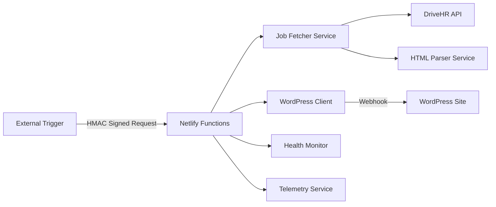

# DriveHR Netlify Sync

> **Enterprise-grade job synchronization service built with TypeScript and
> Netlify Functions**
>
> ✅ **Recently Refactored**: Modular architecture with comprehensive test
> coverage (August 21, 2024)

[](https://github.com/zachatkinson/drivehr-netlify-sync/actions/workflows/ci.yml)
[](https://codecov.io/gh/zachatkinson/drivehr-netlify-sync)
[](https://www.typescriptlang.org/)
[](https://www.netlify.com/)
[](https://opensource.org/licenses/MIT)

A secure, high-performance service that synchronizes job postings from DriveHR
to WordPress via webhook integration. Built with modern TypeScript,
comprehensive testing, and enterprise security standards.

## ✨ Features

- 🔐 **Secure Webhook Processing** - HMAC-SHA256 signature validation
- ⚡ **High Performance** - Optimized Netlify Functions with TypeScript
- 🧪 **Comprehensive Testing** - 80%+ code coverage across 18 test suites
- 📊 **Production Monitoring** - Health checks and telemetry integration
- 🛡️ **Enterprise Security** - CORS, security headers, input validation
- 🔄 **Reliable Sync** - Robust error handling and retry logic
- 📝 **Type Safety** - Full TypeScript with strict configuration

## 🚀 Quick Start

### Prerequisites

- **Node.js** 18+ with **pnpm**
- **Netlify CLI** for local development
- **DriveHR Company ID** (UUID format)
- **WordPress** site with webhook endpoint

### Installation

```bash
# Clone the repository
git clone https://github.com/zachatkinson/drivehr-netlify-sync.git
cd drivehr-netlify-sync

# Install dependencies
pnpm install

# Run tests
pnpm test

# Start local development server
netlify dev
```

### Environment Setup

Create `.env` file:

```env
# Required Configuration
DRIVEHR_COMPANY_ID=your-company-uuid-here
WP_API_URL=https://your-wordpress-site.com/webhook/endpoint
WEBHOOK_SECRET=your-secure-secret-minimum-32-characters

# Optional Configuration
LOG_LEVEL=info
NODE_ENV=development
```

## 🏗️ Architecture



### Core Components

| Component                   | Purpose                 | Location                           |
| --------------------------- | ----------------------- | ---------------------------------- |
| **Sync Jobs Function**      | Main webhook processor  | `src/functions/sync-jobs.mts`      |
| **Health Check Function**   | System monitoring       | `src/functions/health-check.mts`   |
| **Manual Trigger Function** | Administrative controls | `src/functions/manual-trigger.mts` |
| **Job Fetcher Service**     | DriveHR data retrieval  | `src/services/job-fetcher.ts`      |
| **WordPress Client**        | WordPress integration   | `src/services/wordpress-client.ts` |
| **HTML Parser Service**     | Job data extraction     | `src/services/html-parser.ts`      |

## 📡 API Endpoints

### Health Check

```http
GET /.netlify/functions/health-check
```

**Response**: System health status and configuration validation

### Job Synchronization

```http
POST /.netlify/functions/sync-jobs
Content-Type: application/json
X-Webhook-Signature: sha256=<hmac-signature>

{
  "source": "manual",
  "timestamp": "2025-01-21T12:00:00.000Z"
}
```

**Response**: Sync results with job statistics

### Manual Trigger

```http
POST /.netlify/functions/manual-trigger
Content-Type: application/json
X-Webhook-Signature: sha256=<hmac-signature>

{
  "force_sync": true,
  "reason": "Content update required"
}
```

**Response**: Trigger confirmation and execution status

## 🔒 Security

### HMAC Signature Validation

All webhook requests require valid HMAC-SHA256 signatures:

```typescript
const signature = crypto
  .createHmac('sha256', process.env.WEBHOOK_SECRET!)
  .update(JSON.stringify(payload))
  .digest('hex');

const webhookSignature = `sha256=${signature}`;
```

### Security Headers

- **Content Security Policy (CSP)**
- **X-Frame-Options: DENY**
- **X-Content-Type-Options: nosniff**
- **Referrer-Policy: strict-origin-when-cross-origin**
- **Permissions-Policy: geolocation=(), camera=(), microphone=()**

### CORS Configuration

- Restricted to authorized origins
- Specific allowed methods and headers
- Preflight request handling

## 🧪 Testing

### Run Tests

```bash
# Full test suite
pnpm test

# Coverage report
pnpm run test:coverage

# Specific test file
pnpm test test/services/job-fetcher.test.ts

# Watch mode
pnpm test --watch
```

### Test Structure

- **Unit Tests** - Individual function testing
- **Integration Tests** - Service interaction validation
- **Function Tests** - Netlify endpoint testing
- **Mock Tests** - External service simulation

### Current Coverage

- **80.46%** line coverage
- **2,339** of **2,907** lines covered
- **18** comprehensive test suites
- **Zero** critical uncovered paths

## 📊 Monitoring

### Health Monitoring

```bash
# Check system health
curl https://your-site.netlify.app/.netlify/functions/health-check

# Expected response
{
  "success": true,
  "data": {
    "status": "healthy",
    "environment": "production",
    "wordpress_configured": true,
    "architecture": "netlify-functions"
  }
}
```

### Performance Metrics

- Function execution time tracking
- Memory usage monitoring
- Job processing statistics
- Error rate monitoring

### Telemetry Integration

- OpenTelemetry spans and metrics
- Distributed tracing support
- Custom business metrics
- Performance monitoring

## 🚀 Deployment

### Netlify Deployment

1. **Connect Repository**
   - Link your GitHub repository to Netlify
   - Set build command: `pnpm run build`
   - Set publish directory: `dist`

2. **Environment Variables**

   ```bash
   DRIVEHR_COMPANY_ID=your-company-uuid
   WP_API_URL=https://your-wordpress-site.com/webhook/endpoint
   WEBHOOK_SECRET=your-secure-secret-minimum-32-characters
   NODE_ENV=production
   LOG_LEVEL=info
   ```

3. **Deploy**

   ```bash
   # Via Git push (auto-deploy)
   git push origin main

   # Or via Netlify CLI
   netlify deploy --prod
   ```

### Verification

```bash
# Test health endpoint
curl https://your-site.netlify.app/.netlify/functions/health-check

# Test manual trigger (with proper signature)
curl -X POST https://your-site.netlify.app/.netlify/functions/manual-trigger \
  -H "Content-Type: application/json" \
  -H "X-Webhook-Signature: sha256=your-signature" \
  -d '{"force_sync": true, "reason": "deployment verification"}'
```

## 🛠️ Development

### Scripts

```bash
pnpm dev              # Start development server
pnpm build            # Build for production
pnpm test             # Run test suite
pnpm test:coverage    # Generate coverage report
pnpm lint             # ESLint code quality check
pnpm lint:fix         # Auto-fix linting issues
pnpm typecheck        # TypeScript type checking
pnpm format           # Format code with Prettier
```

### Code Quality

- **ESLint** - Zero warnings/errors policy
- **TypeScript** - Strict mode configuration
- **Prettier** - Consistent code formatting
- **Husky** - Pre-commit hooks
- **lint-staged** - Staged file linting

### Pre-commit Checks

All commits must pass:

- TypeScript compilation (`pnpm typecheck`)
- ESLint validation (`pnpm lint`)
- Code formatting (`pnpm format`)
- Test suite (`pnpm test`)

## 📖 Documentation

- **[API Specification](./docs/api-specification.yaml)** - OpenAPI 3.0
  documentation
- **[Architecture Guide](./ARCHITECTURE.md)** - Detailed system architecture
- **[Deployment Guide](./DEPLOYMENT.md)** - Production deployment instructions
- **[Development Standards](./CLAUDE.md)** - Code quality and contribution
  guidelines

## 🤝 Contributing

1. **Fork** the repository
2. **Create** feature branch: `git checkout -b feature/amazing-feature`
3. **Make** your changes following our [development standards](./CLAUDE.md)
4. **Test** your changes: `pnpm test && pnpm lint && pnpm typecheck`
5. **Commit** with conventional commit format:
   `git commit -m 'feat: add amazing feature'`
6. **Push** to branch: `git push origin feature/amazing-feature`
7. **Open** a Pull Request

### Code Standards

- Follow existing code style and patterns
- Maintain or improve test coverage
- Add JSDoc documentation for public APIs
- Use semantic commit messages
- Zero tolerance for ESLint warnings

## 📄 License

This project is licensed under the **MIT License** - see the
[LICENSE](./LICENSE) file for details.

## 🆘 Support

### Getting Help

- **Issues**:
  [GitHub Issues](https://github.com/zachatkinson/drivehr-netlify-sync/issues)
- **Discussions**:
  [GitHub Discussions](https://github.com/zachatkinson/drivehr-netlify-sync/discussions)
- **Documentation**: Check the `docs/` directory

### Troubleshooting

1. **Check Health Endpoint**: Verify system configuration
2. **Review Logs**: Enable debug logging with `LOG_LEVEL=debug`
3. **Validate Environment**: Ensure all required variables are set
4. **Test Connectivity**: Verify WordPress and DriveHR accessibility

---

**Built with ❤️ by the DriveHR team** | **Powered by Netlify Functions &
TypeScript**
