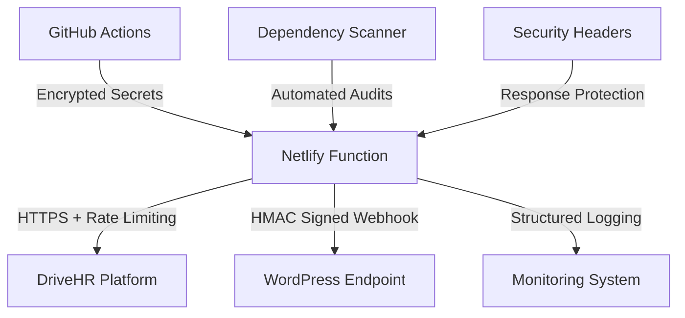

# Security Policy

[](./)
[](./)
[](./)

## Table of Contents

- [Security Overview](#security-overview)
- [Vulnerability Reporting](#vulnerability-reporting)
- [Security Features](#security-features)
- [Authentication & Authorization](#authentication--authorization)
- [Data Protection](#data-protection)
- [Network Security](#network-security)
- [Input Validation](#input-validation)
- [Dependency Security](#dependency-security)
- [CI/CD Security](#cicd-security)
- [Monitoring & Incident Response](#monitoring--incident-response)
- [Compliance Standards](#compliance-standards)
- [Security Auditing](#security-auditing)
- [Best Practices](#best-practices)

## Security Overview

DriveHR Netlify Sync implements enterprise-grade security practices to protect
against common web application vulnerabilities and ensure secure data
transmission between DriveHR, the serverless functions, and WordPress endpoints.

### Security Architecture



### Core Security Principles

- **Defense in Depth**: Multiple layers of security controls
- **Zero Trust Architecture**: Verify and validate all inputs and connections
- **Principle of Least Privilege**: Minimal required permissions only
- **Secure by Default**: Security-first configuration and coding practices
- **Continuous Monitoring**: Real-time threat detection and response

## Vulnerability Reporting

### Reporting Process

We take security vulnerabilities seriously. If you discover a security
vulnerability, please follow our responsible disclosure process:

1. **DO NOT** create a public GitHub issue for security vulnerabilities
2. **DO NOT** discuss the vulnerability in public forums or social media
3. **DO** send a detailed report to our security team

### Contact Information

- **Primary Contact**: [Security Team Email] (to be configured)
- **Response Time**: We aim to acknowledge reports within 24 hours
- **Investigation Time**: Initial assessment within 48 hours
- **Resolution Time**: Critical vulnerabilities addressed within 7 days

### Report Template

Please include the following information in your security report:

```
Subject: Security Vulnerability - DriveHR Netlify Sync

1. Vulnerability Type: [e.g., XSS, SQL Injection, Authentication Bypass]
2. Severity Level: [Critical/High/Medium/Low]
3. Affected Components: [Functions, endpoints, or services]
4. Steps to Reproduce:
   - Step 1
   - Step 2
   - Step 3
5. Expected Impact: [Description of potential damage]
6. Proof of Concept: [Code, screenshots, or demonstration]
7. Suggested Fix: [If known]
8. Reporter Information: [Name, affiliation (optional)]
```

### Rewards Program

While we don't currently offer monetary rewards, we recognize security
researchers by:

- Public acknowledgment in our security hall of fame
- Detailed credit in release notes for fixes
- Direct communication with our development team

## Security Features

### HMAC Signature Validation

All webhook communications use HMAC SHA-256 signature validation:

```typescript
// Signature generation
const signature = crypto
  .createHmac('sha256', process.env.WEBHOOK_SECRET)
  .update(JSON.stringify(payload))
  .digest('hex');

// Header format
headers['X-Hub-Signature-256'] = `sha256=${signature}`;
```

### Rate Limiting

- **Function-level**: 100 requests per 15-minute window
- **IP-based**: Distributed rate limiting across Netlify edge
- **Exponential backoff**: Automatic retry logic with increasing delays
- **Circuit breaker**: Automatic service protection during overload

### Security Headers

All function responses include comprehensive security headers:

```javascript
{
  'Content-Security-Policy': "default-src 'self'; script-src 'none'; object-src 'none'",
  'X-Frame-Options': 'DENY',
  'X-Content-Type-Options': 'nosniff',
  'Referrer-Policy': 'strict-origin-when-cross-origin',
  'Permissions-Policy': 'geolocation=(), microphone=(), camera=(), payment=()',
  'X-XSS-Protection': '1; mode=block',
  'Strict-Transport-Security': 'max-age=31536000; includeSubDomains'
}
```

## Authentication & Authorization

### API Authentication

- **GitHub Actions**: Uses encrypted repository secrets
- **Netlify Functions**: Environment variable-based configuration
- **WordPress Integration**: HMAC signature-based authentication
- **No User Authentication**: System-to-system integration only

### Secret Management

#### Environment Variables

All sensitive data stored as environment variables:

```bash
# Required secrets
WEBHOOK_SECRET=<64-character-hex-secret>
GITHUB_TOKEN=<github-personal-access-token>
DRIVEHR_COMPANY_ID=<company-identifier>

# Optional security configuration
CORS_ORIGINS=https://yoursite.com,https://www.yoursite.com
RATE_LIMIT_MAX=100
RATE_LIMIT_WINDOW=900000
```

#### Secret Rotation

- **Webhook secrets**: Rotate every 90 days minimum
- **GitHub tokens**: Rotate every 6 months or on team changes
- **Company IDs**: Static but validate regularly
- **Automated rotation**: Consider GitHub Actions scheduled secret updates

### Access Control

#### Function Permissions

- **sync-jobs**: Read-only access to DriveHR, write access to WordPress webhook
- **manual-trigger**: GitHub Actions dispatch permissions only
- **health-check**: No external permissions required

#### Network Access

- **Outbound**: Limited to DriveHR domains and WordPress webhook URLs
- **Inbound**: Netlify edge network with DDoS protection
- **Internal**: No inter-function communication required

## Data Protection

### Data Classification

#### Sensitive Data

- Webhook secrets and authentication tokens
- Internal system configuration
- Error logs containing stack traces

#### Public Data

- Job posting information (already public on DriveHR)
- Company information (publicly available)
- System health and status information

### Data Handling

#### In Transit

- **HTTPS enforced** for all external communications
- **TLS 1.2+** minimum for all connections
- **Certificate validation** for all external services
- **No sensitive data** in URL parameters or headers (except signatures)

#### At Rest

- **No persistent storage** in functions (stateless architecture)
- **Temporary data** cleared after function execution
- **Logs encrypted** by Netlify platform
- **No local file storage** of sensitive information

#### Data Retention

- **Function logs**: 30 days (Netlify managed)
- **Monitoring data**: 90 days for troubleshooting
- **Security logs**: 1 year for audit purposes
- **No job data storage**: Pass-through processing only

### Privacy Compliance

- **GDPR Compliance**: No personal data processing
- **CCPA Compliance**: No California resident data handling
- **Data Minimization**: Process only required job posting fields
- **Purpose Limitation**: Data used only for job synchronization

## Network Security

### HTTPS Enforcement

- **Strict HTTPS**: All communications encrypted in transit
- **HSTS Headers**: Enforce HTTPS in browsers
- **Certificate Validation**: Verify all external service certificates
- **No HTTP Fallback**: Reject all non-encrypted connections

### CORS Configuration

```javascript
// Restrictive CORS policy
const corsOptions = {
  origin: process.env.CORS_ORIGINS?.split(',') || ['https://yoursite.com'],
  methods: ['GET', 'POST'],
  allowedHeaders: ['Content-Type', 'X-Hub-Signature-256'],
  credentials: false,
  maxAge: 86400,
};
```

### DNS Security

- **DNS over HTTPS**: Use secure DNS resolution
- **Domain validation**: Verify destination domains
- **Subdomain isolation**: Separate staging and production environments
- **Certificate pinning**: Consider for high-security environments

## Input Validation

### Schema Validation

All inputs validated using Zod schemas:

```typescript
// Job data validation
const JobSchema = z.object({
  title: z.string().min(1).max(200).trim(),
  department: z.string().max(100).trim(),
  location: z.string().max(200).trim(),
  type: z.enum(['Full-time', 'Part-time', 'Contract', 'Internship']),
  description: z.string().max(5000).trim(),
  postedDate: z.string().datetime(),
  applyUrl: z.string().url().max(500),
});

// Webhook payload validation
const WebhookPayloadSchema = z.object({
  source: z.enum(['webhook', 'manual', 'scheduled']),
  jobs: z.array(JobSchema),
  timestamp: z.string().datetime(),
  requestId: z.string().uuid(),
});
```

### Sanitization

- **HTML sanitization**: Strip HTML tags from all text inputs
- **SQL injection prevention**: Use parameterized queries (if applicable)
- **XSS prevention**: Encode all output data
- **Path traversal prevention**: Validate all file paths

### Rate Limiting

```typescript
// Function-level rate limiting
const rateLimitConfig = {
  windowMs: 15 * 60 * 1000, // 15 minutes
  max: 100, // limit each IP to 100 requests per windowMs
  standardHeaders: true,
  legacyHeaders: false,
  handler: (req, res) => {
    res.status(429).json({
      error: 'Too many requests',
      retryAfter: Math.ceil(windowMs / 1000),
    });
  },
};
```

## Dependency Security

### Automated Scanning

#### pnpm audit Integration

Multi-level security scanning integrated into CI/CD:

```bash
# Moderate level (CI/CD default)
pnpm audit --audit-level moderate

# High severity (production releases)
pnpm audit --audit-level high --prod

# Auto-fix capability
pnpm audit --fix
```

#### GitHub Security Advisories

- **Dependabot alerts**: Automatically monitor for vulnerabilities
- **Auto-updates**: Enable for patch-level security updates
- **Review process**: Manual review for major version updates
- **Security-first**: Prioritize security updates over feature updates

### Dependency Management

#### Package Selection Criteria

- **Maintenance status**: Active development and security updates
- **Community trust**: High download counts and GitHub stars
- **Security track record**: History of responsible vulnerability disclosure
- **Minimal dependencies**: Prefer packages with fewer transitive dependencies

#### Version Pinning

```json
{
  "dependencies": {
    "@opentelemetry/api": "^1.9.0",
    "playwright": "^1.55.0",
    "cheerio": "^1.1.2"
  },
  "pnpm": {
    "overrides": {
      "tmp": ">=0.2.4"
    }
  }
}
```

#### Regular Updates

- **Monthly reviews**: Check for security updates
- **Automated PRs**: Dependabot for patch-level updates
- **Testing requirements**: All updates must pass full test suite
- **Rollback plan**: Quick rollback process for problematic updates

## CI/CD Security

### GitHub Actions Security

#### Secret Management

```yaml
# Secure secret usage
- name: Deploy to Netlify
  env:
    NETLIFY_AUTH_TOKEN: ${{ secrets.NETLIFY_AUTH_TOKEN }}
    NETLIFY_SITE_ID: ${{ secrets.NETLIFY_SITE_ID }}
  run: netlify deploy --prod
```

#### Workflow Permissions

```yaml
permissions:
  contents: read
  actions: read
  security-events: write
  id-token: write
```

#### Security Scanning

- **Dependency scanning**: Automated vulnerability detection
- **Code scanning**: Static analysis for security issues
- **Secret scanning**: Prevent credential commits
- **Supply chain security**: Verify action authenticity

### Build Security

#### Container Security

- **Minimal base images**: Use distroless or alpine images
- **Multi-stage builds**: Separate build and runtime environments
- **Vulnerability scanning**: Scan container images before deployment
- **Non-root execution**: Run as non-privileged user

#### Artifact Security

- **Signed artifacts**: Use artifact signing for releases
- **Checksum validation**: Verify artifact integrity
- **Secure storage**: Encrypted artifact storage
- **Access controls**: Limited artifact access permissions

## Monitoring & Incident Response

### Security Monitoring

#### Real-time Alerting

```typescript
// Security event monitoring
const securityEvents = {
  webhook_signature_failure: 'critical',
  rate_limit_exceeded: 'warning',
  authentication_failure: 'critical',
  unexpected_error_rate: 'warning',
};
```

#### Log Analysis

- **Structured logging**: JSON format for automated analysis
- **Security correlation**: Link related security events
- **Anomaly detection**: Identify unusual patterns
- **Retention policies**: Secure log storage and cleanup

### Incident Response

#### Response Team

- **Primary**: Lead Developer
- **Secondary**: DevOps Engineer
- **Escalation**: Security Team Lead

#### Response Procedures

1. **Immediate Response** (0-1 hour)
   - Assess severity and impact
   - Contain the threat if possible
   - Document initial findings

2. **Investigation** (1-8 hours)
   - Detailed forensic analysis
   - Identify root cause
   - Assess data exposure

3. **Remediation** (8-24 hours)
   - Deploy security fixes
   - Update monitoring rules
   - Strengthen defenses

4. **Recovery** (24-48 hours)
   - Restore normal operations
   - Validate fix effectiveness
   - Update documentation

5. **Post-Incident** (48-72 hours)
   - Conduct lessons learned review
   - Update security procedures
   - Implement preventive measures

### Communication Plan

- **Internal**: Slack security channel for team updates
- **External**: Status page for user-facing issues
- **Stakeholders**: Email updates for management
- **Public**: Security advisory for disclosed vulnerabilities

## Compliance Standards

### Industry Standards

#### OWASP Top 10 (2021)

- **A01 Broken Access Control**: ✅ Implemented HMAC validation
- **A02 Cryptographic Failures**: ✅ TLS 1.2+, HMAC SHA-256
- **A03 Injection**: ✅ Input validation with Zod schemas
- **A04 Insecure Design**: ✅ Secure-by-default architecture
- **A05 Security Misconfiguration**: ✅ Security headers, HTTPS enforcement
- **A06 Vulnerable Components**: ✅ Automated dependency scanning
- **A07 Identity Authentication**: ✅ System-to-system authentication
- **A08 Software Integrity**: ✅ Dependency verification, signed artifacts
- **A09 Logging Monitoring**: ✅ Structured logging, security monitoring
- **A10 Server-Side Request Forgery**: ✅ URL validation, allowlisting

#### NIST Cybersecurity Framework

- **Identify**: Asset inventory and risk assessment
- **Protect**: Access controls and security awareness
- **Detect**: Continuous monitoring and detection
- **Respond**: Incident response procedures
- **Recover**: Recovery planning and improvements

### Regulatory Compliance

#### GDPR Considerations

- **Data Minimization**: Process only required job data
- **Purpose Limitation**: Use data only for job synchronization
- **Storage Limitation**: No persistent data storage
- **Data Subject Rights**: No personal data processed

#### SOC 2 Type II

- **Security**: Comprehensive security controls
- **Availability**: High availability architecture
- **Processing Integrity**: Data validation and error handling
- **Confidentiality**: Encryption and access controls
- **Privacy**: Minimal data processing

## Security Auditing

### Internal Audits

#### Monthly Security Reviews

- [ ] Dependency vulnerability scan results
- [ ] Access control validation
- [ ] Secret rotation status
- [ ] Security monitoring effectiveness
- [ ] Incident response readiness

#### Quarterly Assessments

- [ ] Threat model review and updates
- [ ] Security control effectiveness
- [ ] Compliance gap analysis
- [ ] Security awareness training
- [ ] Business continuity testing

### External Audits

#### Annual Security Assessment

- **Penetration testing**: Third-party security testing
- **Vulnerability assessment**: Comprehensive security scan
- **Code review**: External security code analysis
- **Compliance audit**: Regulatory compliance verification

#### Bug Bounty Program

- **Scope**: Production environment security testing
- **Rewards**: Recognition and potential monetary rewards
- **Rules**: Responsible disclosure requirements
- **Communication**: Direct channel to security team

### Audit Trails

#### Security Events

```typescript
// Security event logging
logger.security('webhook_signature_validation', {
  result: 'success',
  source_ip: req.ip,
  user_agent: req.headers['user-agent'],
  timestamp: new Date().toISOString(),
  request_id: req.headers['x-request-id'],
});
```

#### Access Logs

- **Function invocations**: Track all function executions
- **External requests**: Log all outbound API calls
- **Error patterns**: Monitor for unusual error rates
- **Performance metrics**: Detect potential DoS attacks

## Best Practices

### Secure Development

#### Code Review Checklist

- [ ] Input validation implemented
- [ ] Output encoding applied
- [ ] Authentication verified
- [ ] Authorization checked
- [ ] Error handling secure
- [ ] Logging includes security events
- [ ] No hardcoded secrets
- [ ] Dependencies up to date

#### Security Testing

```typescript
// Example security test
describe('Webhook Security', () => {
  it('should reject requests without valid HMAC signature', async () => {
    const response = await request(app)
      .post('/webhook')
      .send({ data: 'test' })
      .expect(401);

    expect(response.body.error).toBe('Invalid signature');
  });
});
```

### Operational Security

#### Environment Separation

- **Development**: Isolated with test data only
- **Staging**: Production-like with sanitized data
- **Production**: Fully secured with real data

#### Backup and Recovery

- **Configuration backup**: Regular backup of environment variables
- **Code repository**: Multiple mirrors and backups
- **Incident response**: Tested recovery procedures
- **Business continuity**: Minimal downtime objectives

### Team Security

#### Security Awareness

- **Regular training**: Security best practices
- **Threat updates**: Current attack vectors
- **Incident simulation**: Tabletop exercises
- **Tool training**: Security tool usage

#### Access Management

- **Principle of least privilege**: Minimal required access
- **Regular access review**: Quarterly access audits
- **Onboarding/offboarding**: Secure credential management
- **MFA enforcement**: Multi-factor authentication required

## Contact Information

### Security Team

- **Security Lead**: [To be configured]
- **Primary Contact**: [security@yourcompany.com]
- **Emergency Contact**: [Available 24/7 for critical issues]

### Reporting Channels

- **Email**: security@yourcompany.com
- **Phone**: [Emergency hotline for critical issues]
- **Encrypted**: PGP key available for sensitive reports

---

## Document Information

- **Version**: 1.0.0
- **Last Updated**: 2025-01-25
- **Next Review**: 2025-04-25
- **Owner**: Security Team
- **Approved By**: [CTO/CISO]

---

**This security policy is a living document and will be updated regularly to
address new threats and compliance requirements.**
